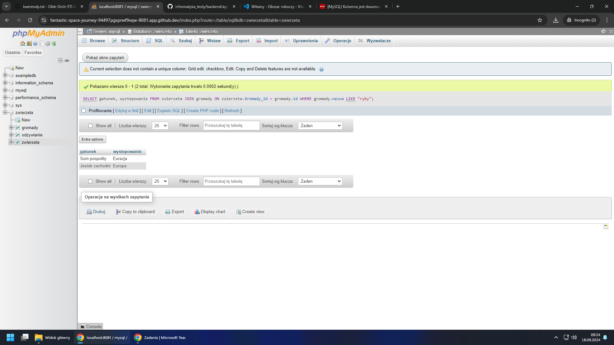
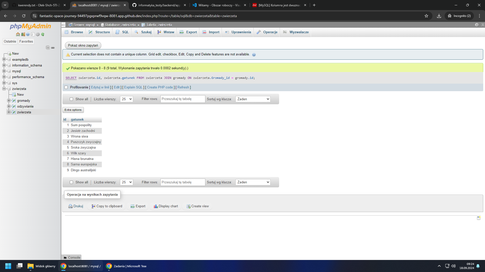
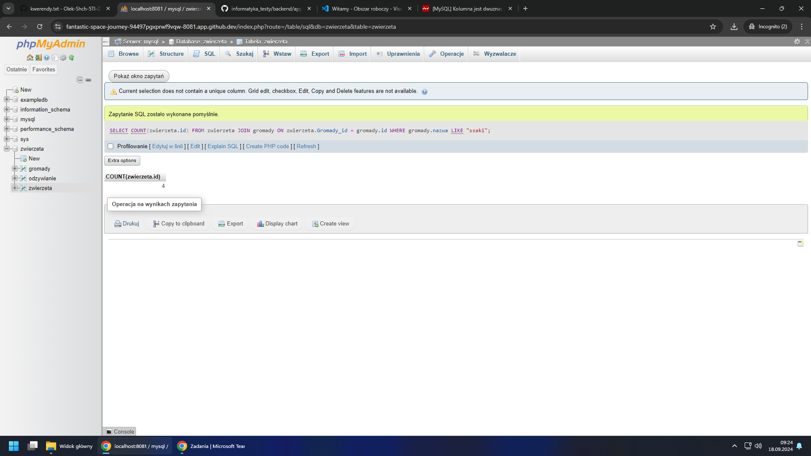
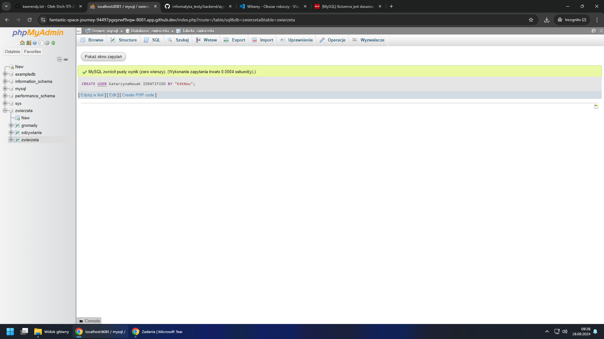

1 - SELECT gatunek, wystepowanie FROM zwierzeta JOIN gromady ON zwierzeta.Gromady_id = gromady.id WHERE gromady.nazwa LIKE "ryby";

2 - SELECT zwierzeta.id, zwierzeta.gatunek FROM zwierzeta JOIN gromady ON zwierzeta.Gromady_id = gromady.id;

3 - SELECT COUNT(zwierzeta.id) FROM zwierzeta JOIN gromady ON zwierzeta.Gromady_id = gromady.id WHERE gromady.nazwa LIKE "ssaki";

4 - CREATE USER KatarzynaNowak IDENTIFIED BY "K4tNow";

